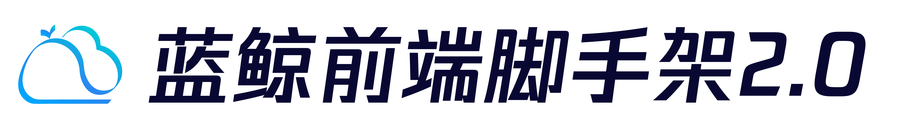

---
[](https://github.com/TencentBlueKing/bkui-cli/blob/master/LICENSE.txt) [](https://github.com/TencentBlueKing/bkui-cli/releases) [](https://github.com/TencentBlueKing/bkui-cli/pulls)

[English](README_EN.md) | 简体中文
# BKUI-CLI
基于蓝鲸 Magicbox 和 Vue 的前端脚手架

## 安装
```bash
$ npm install -g @blueking/cli
```

## 快速使用
```bash
$ bkui init projectName
```

## 提供服务
- [前端框架](packages/@bkui/template-vue)：基于蓝鲸 Magicbox 和 Vue 的框架
- [webpack5 服务](packages/@bkui/cli-service-webpack5)：内置webapck相关配置，帮助开发者更方便的使用webpack
- [babel 预设](packages/@bkui/babel-preset-bk)：减少用户配置 Babel 的步骤
- [eslint 配置](packages/@bkui/eslint-config-bk)：集成腾讯 TypeScript、JavaScript 和蓝鲸 VUE 规范，方便用户快速配置 eslint
- [stylelint 配置](packages/@bkui/stylelint-config-bk)：集成腾讯 css 规范，方便用户快速配置 stylelint

## 查看帮助
```bash
$ bkui -h
```

## BlueKing Community
- [BK-CMDB](https://github.com/Tencent/bk-cmdb)：蓝鲸配置平台（蓝鲸 CMDB）是一个面向资产及应用的企业级配置管理平台。

- [BK-CI](https://github.com/Tencent/bk-ci)：蓝鲸持续集成平台是一个开源的持续集成和持续交付系统，可以轻松将你的研发流程呈现到你面前。

- [BK-BCS](https://github.com/Tencent/bk-bcs)：蓝鲸容器管理平台是以容器技术为基础，为微服务业务提供编排管理的基础服务平台。

- [BK-PaaS](https://github.com/Tencent/bk-paas)：蓝鲸 PaaS 平台是一个开放式的开发平台，让开发者可以方便快捷地创建、开发、部署和管理 SaaS 应用。

- [BK-SOPS](https://github.com/Tencent/bk-sops)：标准运维（SOPS）是通过可视化的图形界面进行任务流程编排和执行的系统，是蓝鲸体系中一款轻量级的调度编排类 SaaS 产品。

- [BK-JOB](https://github.com/Tencent/bk-job) 蓝鲸作业平台(Job)是一套运维脚本管理系统，具备海量任务并发处理能力。

## Contributing
- 关于 bkui-cli 分支管理、issue 以及 pr 规范，请阅读 [Contributing](docs/CONTRIBUTING.md)
- [腾讯开源激励计划](https://opensource.tencent.com/contribution) 鼓励开发者的参与和贡献，期待你的加入

## License
基于 MIT 协议， 详细请参考 [LICENSE](LICENSE.txt)