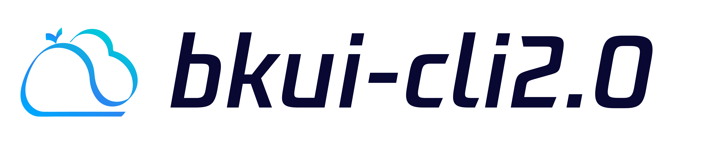

---
[](https://github.com/TencentBlueKing/bkui-cli/blob/master/LICENSE.txt) [](https://github.com/TencentBlueKing/bkui-cli/releases) [](https://github.com/TencentBlueKing/bkui-cli/pulls)

English | [简体中文](README.md)
# BKUI-CLI
Front-end CLI based on Blueking Magicbox and Vue

## Install
```bash
$ npm install -g @blueking/cli
```

## Getting started
```bash
$ bkui init projectName
```

## Features
- [Front-end Framework](packages/@bkui/template-vue)：Framework based on Blueking Magicbox and Vue
- [Webpack5 Service](packages/@bkui/cli-service-webpack5)：Built-in webapck configuration to help developers use webpack more easily
- [Babel Preset](packages/@bkui/babel-preset-bk)：Reduce steps for users to configure Babel
- [Eslint Config](packages/@bkui/eslint-config-bk)：Integrate Tencent TypeScript, JavaScript and Blueking VUE specifications to facilitate users to quickly configure eslint
- [Stylelint Config](packages/@bkui/stylelint-config-bk)：Integrate Tencent CSS specification to facilitate users to quickly configure stylelint

## Help
```bash
$ bkui -h
```

## BlueKing Community
- [BK-CMDB](https://github.com/Tencent/bk-cmdb): BlueKing CMDB is an enterprise-level management platform designed for assets and applications.

- [BK-CI](https://github.com/Tencent/bk-ci): BlueKing Continuous Integration platform is a free, open source CI service, which allows developers to automatically create - test - release workflow, and continuously, efficiently deliver their high-quality products.

- [BK-BCS](https://github.com/Tencent/bk-bcs): BlueKing Container Service is a container-based basic service platform that provides management service to microservice businesses.

- [BK-PaaS](https://github.com/Tencent/bk-paas): BlueKing PaaS is an open development platform that allows developers to efficiently create, develop, set up, and manage SaaS apps.

- [BK-SOPS](https://github.com/Tencent/bk-sops): BlueKing SOPS is a system that features workflow arrangement and execution using a graphical interface. It's a lightweight task scheduling and arrangement SaaS product of the Blueking system.

- [BK-JOB](https://github.com/Tencent/bk-job):BlueKing JOB is a set of operation and maintenance script management platform with the ability to handle a large number of tasks concurrently.

## Contributing
- Please read [Contributing(In Chinese)](docs/CONTRIBUTING.md) for the branch management, issue and pr specifications of bkui-cli.
- [Tencent Open Source Incentive Program](https://opensource.tencent.com/contribution) encourages the participation and contribution of developers. We look forward to having you join it.

## License
Based on the MIT license. Please refer to [LICENCE](LICENSE.txt) for details.